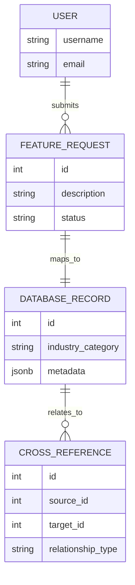
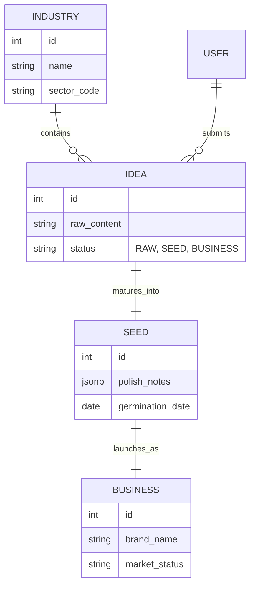
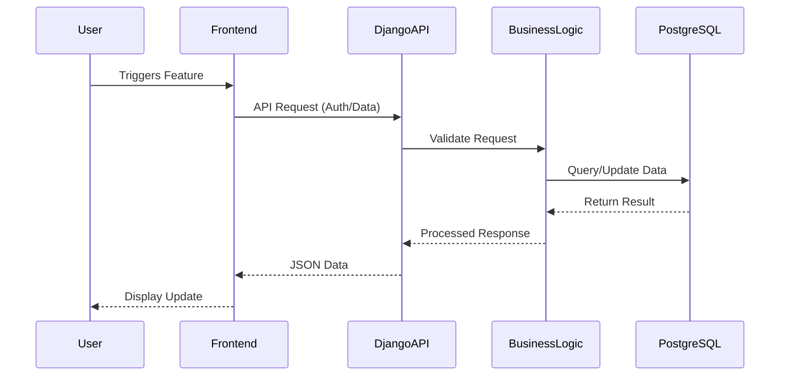
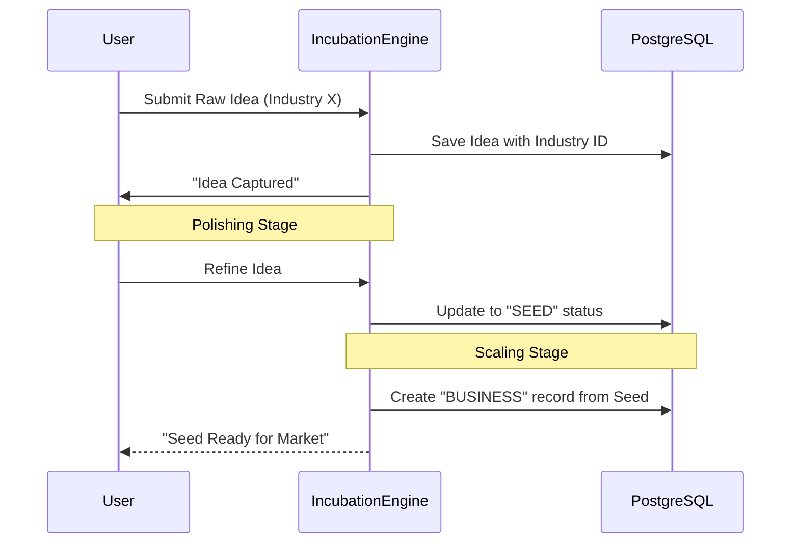

# Architecture

## Project Middle Layer Platform Docs

- [Project Middle Layer Platform Release Bulletin](project_middle_layer_platform_release_bulletin.md)
- [Project Middle Layer Semantic OS Overview](project_middle_layer_semantic_os_overview.md)
- [Project Middle Layer Platform Release Notes (Phase 1 to Phase 10)](project_middle_layer_platform_release_notes_phase1_to_phase10.md)
- [Project Middle Layer Semantic Architecture Overview](project_middle_layer_semantic_architecture_overview.md)
- [Project Middle Layer Operator Quickstart](../operations/project_middle_layer_operator_quickstart.md)
- [Project Middle Layer Developer Onboarding Guide](../operations/project_middle_layer_developer_onboarding_guide.md)

## ERD: Feature Request Mapping



## ERD: Idea to Business Lifecycle



## Workflow: Request Processing



## Workflow: Incubation Engine




## Lattice Architecture

The 12-compartment lattice uses a geometric power series with base $4^n$ to define capacity.

## BTSRL Alias Workflow

BTSRL is the simplified public alias for the BaseTrue Square Root Lattice.
It keeps the front-end workflow easy to understand while preserving the full lattice filing structure for advanced operations.

### Simple workflow modes
- 4 steps: one linear phase for simple work
- 8 steps: two linked phases for moderate work
- 12 steps: perpetual workflow cycle that mirrors a 24-hour operating day

### Time representation of transactions
- 12 compartments can be mirrored into a 24-hour view for easier access and review.
- The first 12 hours represent the primary pass through the workflow.
- The second 12 hours represent the review, synthesis, and reporting pass.
- This gives users a simple time-based lens for tracking transactions while keeping the lattice registry intact.

### Advanced navigation model
- Keep simple workflow as the default landing experience.
- Expose lattice, taxonomy, benchmark, and presentation tools from the navigation dropdown.
- Use the 4 to 16,777,216 filing structure as the underlying registry for power users and AI prompts.

```mermaid
graph TD
    subgraph "The 12-Compartment Lattice"
    C1[1: Red/Past - Math - 4] --> C2[2: Blue/Present-Past - Language - 16]
    C2 --> C3[3: Yellow/Present-Future - Arts - 64]
    C3 --> C4[4: Green/Future - Science]
    C4 --> C5[5: Purple/Past - General Information - 1024]
    C5 --> C6[6: Teal/Present-Past - Literature - 4096]
    C6 --> C7[7: Orange/Present-Future - Crafts - 16384]
    C7 --> C8[8: Lime/Future - Technology - 65536]
    C8 --> C9[9: Pink/Past - History - 262144]
    C9 --> C10[10: Cyan/Present-Past - Geology - 1048576]
    C10 --> C11[11: Amber/Present-Future - Philosophy/Ethics - 4194304]
    C11 --> C12[12: Green-Lime/Future - Systems/Synthesis - 16777216]
    end

    style C1 fill:#f96,stroke:#333
    style C4 fill:#9f9,stroke:#333
    style C12 fill:#0f0,stroke:#333
```



| Index | Color | Time Frame | Capacity | Category |
| --- | --- | --- | ---: | --- |
| 1 | Red | Past | 4 | Math |
| 2 | Blue | Present/Past | 16 | Language |
| 3 | Yellow | Present/Future | 64 | Arts |
| 4 | Green | Future | 256 | Science |
| 5 | Purple | Past | 1,024 | General Information |
| 6 | Teal | Present/Past | 4,096 | Literature |
| 7 | Orange | Present/Future | 16,384 | Crafts |
| 8 | Lime | Future | 65,536 | Technology |
| 9 | Pink | Past | 262,144 | History |
| 10 | Cyan | Present/Past | 1,048,576 | Geology |
| 11 | Amber | Present/Future | 4,194,304 | Philosophy/Ethics |
| 12 | Green-Lime | Future | 16,777,216 | Systems/Synthesis |

## Presentation Pipeline

Slide-driven UI scaffolding lives under [docs/architecture/presentation/](presentation/README.md):

- [docs/architecture/presentation/slides/](presentation/slides/ui_blueprint_standard.mdx) stores MDX UI blueprints.
- [docs/architecture/presentation/ui/generated/](presentation/ui/generated/manifest.json) stores generated React artifacts and manifest metadata.

The scaffold workflow includes MDX parsing + React generation automatically through:

```bash
./a_gr_venv/bin/python manage.py scaffold_onepager <app_name>
```

## Workflow Platform Architecture (Phase-4)

The canonical workflow command center is now rooted at:

- workflow/database_design/mermaid_erds
- workflow/logic_design/mermaid_sequences
- workflow/ui_templates/penpot_templates
- workflow/ui_components/penpot_components

The workflow engine lives in workflow/_engine and is orchestrated through workflow/cli.py.

### Engine Layers

1. Scaffold Layer
- create deterministic feature artifacts and registry entries.

2. Semantic Layer
- MLAS classification mapping from registry metadata.
- BTIF route assignment and consistency checks.

3. Sync Layer
- ERD to backend model stubs.
- Sequence to backend logic stubs.
- UI template to generated React page stubs.
- UI component spec to generated design-system component stubs.

4. Propagation Layer
- propagates normalized semantic metadata into registry feature propagation blocks.

### CLI Surface

- python3 workflow/cli.py new-feature
- python3 workflow/cli.py validate
- python3 workflow/cli.py validate-suite
- python3 workflow/cli.py classify
- python3 workflow/cli.py semantic-check
- python3 workflow/cli.py sync --feature <slug>
- python3 workflow/cli.py sync-all

### Registry Schema (Current)

Feature entries in workflow/meta/registry.json include:

- name
- slug
- mlas_tier
- btif_classification
- semantic_intent
- semantic_tags
- paths
- status
- propagation

This makes workflow the deterministic architecture spine for feature generation, semantic classification, and synchronized stub outputs.