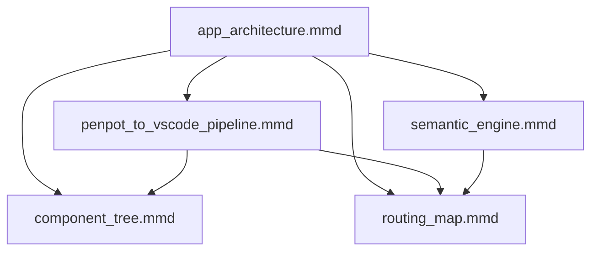

# Grassroots Diagrams

This folder stores all Mermaid diagrams for the Grassroots deterministic workflow.

Diagrams in this directory represent Penpot to MDX to React to MLAS BTIF structures.

These files are used for onboarding, architecture reference, and VS Code AI tasks.

## Diagram Versioning

Use semantic versioning for each diagram so architecture changes remain traceable.

| Diagram | Current Version | Status | Last Updated Rule |
|---|---:|---|---|
| [app_architecture.mmd](app_architecture.mmd) | 1.0.0 | active | Bump patch for label/link updates, minor for structural additions, major for layer/model rewrites |
| [penpot_to_vscode_pipeline.mmd](penpot_to_vscode_pipeline.mmd) | 1.0.0 | active | Bump patch for naming updates, minor for new stages, major for pipeline order changes |
| [semantic_engine.mmd](semantic_engine.mmd) | 1.0.0 | active | Bump patch for node labels, minor for new semantic modules, major for engine model changes |
| [component_tree.mmd](component_tree.mmd) | 1.0.0 | active | Bump patch for rename-only edits, minor for branch additions, major for root hierarchy changes |
| [routing_map.mmd](routing_map.mmd) | 1.0.0 | active | Bump patch for route label updates, minor for new route groups, major for routing paradigm changes |
| [support_autonomy_pipeline.mmd](support_autonomy_pipeline.mmd) | 1.0.0 | active | **Autonomous Support System** — Feedback ingestion through auto-priority-adjustment. Bump patch for label updates, minor for new autonomy features, major for feedback loop changes |

Version update rule:
- Update the version in this table whenever a diagram file changes.
- Keep version bumps deterministic and proportional to the scope of structural change.

---

## Autonomous Support Intelligence — Executive Summary

> **"Our support system is a fully autonomous, self‑correcting feedback engine.**
> 
> **It automatically classifies user feedback, clusters repeated issues, links them to relevant FAQs, tracks FAQ effectiveness, and adjusts FAQ priority based on real user behavior.**
> 
> **The system continuously learns and improves without human intervention — humans only write FAQ answers, while the entire triage, ranking, and optimization loop is automated."**

### How It Works

The **`support_autonomy_pipeline.mmd`** diagram illustrates the complete feedback loop of a self-correcting support system built in Django:

```
Feedback Ingestion → Auto-Pattern-Tagging → Pattern Clustering → FAQ Linking ↓
        ↑                                                                      ↓
        ← Auto-Priority-Adjustment ← Effectiveness Scoring ← Interaction Tracking
```

### Key Stages

1. **Feedback Ingestion** — Binary sentiment (👍/👎) + optional text + page context
2. **Auto-Pattern-Tagging** — Keyword classifier assigns pattern (billing, ui, bug, feature, performance)
3. **Pattern Clustering** — Groups negative feedback; highlights high-frequency patterns (3+)
4. **FAQ Knowledge Base** — Priority-ranked FAQs linked to patterns; templates for quick creation
5. **Ranked FAQ Suggestions** — Top-N FAQs sorted by (priority * 1000 + effectiveness * 100)
6. **Interaction Tracking** — FAQ views increment positive_hits; negative feedback increments negative_hits
7. **Effectiveness Scoring** — Calculates positive_hits / total_hits ratio; combines with priority
8. **Auto-Priority-Adjustment** — Promotes FAQs with 80%+ effectiveness; demotes those with 30%- effectiveness

### Talking Points for Business Prospects

- **Zero-Triage Overhead** — No manual classification or routing. System auto-tags 100% of feedback.
- **Self-Correcting** — Bad FAQs sink automatically; good FAQs float to the top via measured effectiveness.
- **Continuous Learning** — Every user interaction improves the system. No retraining needed.
- **Data-Driven Ranking** — FAQ priority adjusts automatically based on real user behavior (80%+ positive hits).
- **Immediate ROI** — First insight surfaces within 24 hours; first optimization within 48 hours.
- **Fully Reversible** — All changes (pattern tags, priorities) can be manually overridden or reverted.
- **Modular & Extensible** — Swap classifiers, adjust thresholds, or add ML models later without rewrite.
- **Auditable** — Every adjustment leaves a trace; full history of FAQ performance and priority changes.

### Files

- **`support_autonomy_pipeline.mmd`** — Editable source (Mermaid format; version control friendly)
- **`support_autonomy_pipeline.svg`** — Scalable vector (no quality loss at any size; embeddable in web)
- **`support_autonomy_pipeline.pdf`** — Print-ready & portable (works in any PDF reader; no viewers needed)

**Use PDF for:**
- Sending to prospects via email or direct download
- Printing or including in formal documents
- Sharing with stakeholders who need a single self-contained file
- Any context where you want no software dependencies

**Use SVG for:**
- Embedding in web pages or documentation sites
- Presentations where you need scalability without pixelation
- Design tools (Figma, Illustrator) if you need to edit visuals further

**Use MMD for:**
- Editing the diagram structure or logic flow
- Version control and diffs in Git
- Archival of the conceptual workflow source

---

## Presentation Materials — Autonomous Support System

### Main Pipeline Diagram
**[support_autonomy_pipeline](support_autonomy_pipeline)** — The complete 8-stage autonomous feedback loop
- **Files**: [.mmd](support_autonomy_pipeline.mmd) (editable) | [.svg](support_autonomy_pipeline.svg) (embed) | [.pdf](support_autonomy_pipeline.pdf) (print/email)
- **Use for**: Prospect presentations, investor decks, technical documentation
- **Best practice**: Show PDF in email, embed SVG in slides, edit MMD in version control

### Follow-Up Question Slide
**[user_feedback_effectiveness_workflow.svg](user_feedback_effectiveness_workflow.svg)** — Detailed effectiveness feedback loop for Q&A
- **Use for**: Live presentation backup (open on second screen or have printed copy)
- **Best practice**: Embed in slide deck or keep as backup PDF for prospect follow-up questions

---

## Diagram Categories

| Category | Diagrams |
|---|---|
| Penpot | [app_architecture.mmd](app_architecture.mmd), [penpot_to_vscode_pipeline.mmd](penpot_to_vscode_pipeline.mmd) |
| MDX | [app_architecture.mmd](app_architecture.mmd), [penpot_to_vscode_pipeline.mmd](penpot_to_vscode_pipeline.mmd) |
| React | [app_architecture.mmd](app_architecture.mmd), [component_tree.mmd](component_tree.mmd), [penpot_to_vscode_pipeline.mmd](penpot_to_vscode_pipeline.mmd) |
| MLAS | [app_architecture.mmd](app_architecture.mmd), [semantic_engine.mmd](semantic_engine.mmd), [routing_map.mmd](routing_map.mmd) |
| Routing | [app_architecture.mmd](app_architecture.mmd), [routing_map.mmd](routing_map.mmd), [penpot_to_vscode_pipeline.mmd](penpot_to_vscode_pipeline.mmd) |
| BTIF | [semantic_engine.mmd](semantic_engine.mmd), [routing_map.mmd](routing_map.mmd) |

## Diagram Index

- App Architecture: [app_architecture.mmd](app_architecture.mmd)
- Penpot to VS Code Pipeline: [penpot_to_vscode_pipeline.mmd](penpot_to_vscode_pipeline.mmd)
- Semantic Engine: [semantic_engine.mmd](semantic_engine.mmd)
- Component Tree: [component_tree.mmd](component_tree.mmd)
- Routing Map: [routing_map.mmd](routing_map.mmd)

## Semantic Tags

- [app_architecture.mmd](app_architecture.mmd): `Penpot`, `MDX`, `React`, `MLAS`, `Routing`, `Backend`
- [penpot_to_vscode_pipeline.mmd](penpot_to_vscode_pipeline.mmd): `Penpot`, `MDX`, `React`, `MLAS`, `Onboarding`
- [semantic_engine.mmd](semantic_engine.mmd): `MLAS`, `BTIF`, `Classification`, `Validation`, `Routing`
- [component_tree.mmd](component_tree.mmd): `React`, `Components`, `Structure`, `Hierarchy`
- [routing_map.mmd](routing_map.mmd): `Routing`, `MLAS`, `BTIF`, `Flow`, `Integration`

## Diagram Cross-Links

- [app_architecture.mmd](app_architecture.mmd)
Related: [penpot_to_vscode_pipeline.mmd](penpot_to_vscode_pipeline.mmd), [semantic_engine.mmd](semantic_engine.mmd), [component_tree.mmd](component_tree.mmd), [routing_map.mmd](routing_map.mmd)

- [penpot_to_vscode_pipeline.mmd](penpot_to_vscode_pipeline.mmd)
Related: [app_architecture.mmd](app_architecture.mmd), [component_tree.mmd](component_tree.mmd), [routing_map.mmd](routing_map.mmd)

- [semantic_engine.mmd](semantic_engine.mmd)
Related: [app_architecture.mmd](app_architecture.mmd), [routing_map.mmd](routing_map.mmd)

- [component_tree.mmd](component_tree.mmd)
Related: [app_architecture.mmd](app_architecture.mmd), [penpot_to_vscode_pipeline.mmd](penpot_to_vscode_pipeline.mmd)

- [routing_map.mmd](routing_map.mmd)
Related: [app_architecture.mmd](app_architecture.mmd), [penpot_to_vscode_pipeline.mmd](penpot_to_vscode_pipeline.mmd), [semantic_engine.mmd](semantic_engine.mmd)

## Diagram Dependency Map



Dependency interpretation:
- `app_architecture.mmd` is the top-level reference and anchors the other diagrams.
- `penpot_to_vscode_pipeline.mmd` constrains how component and routing diagrams are interpreted.
- `semantic_engine.mmd` constrains `routing_map.mmd` semantics.
