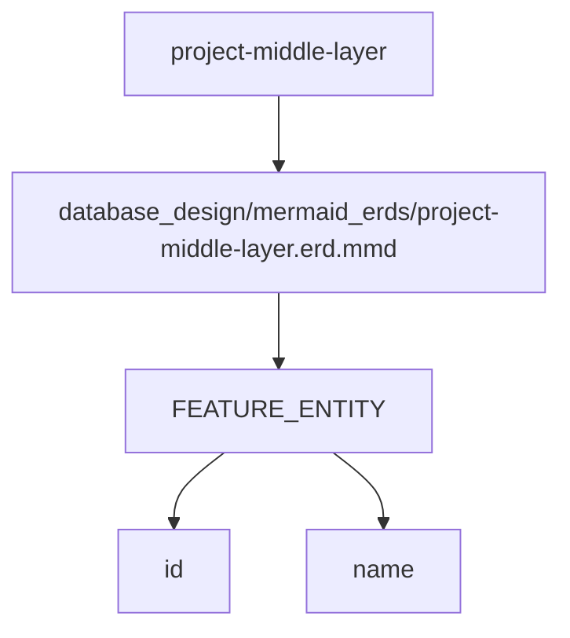
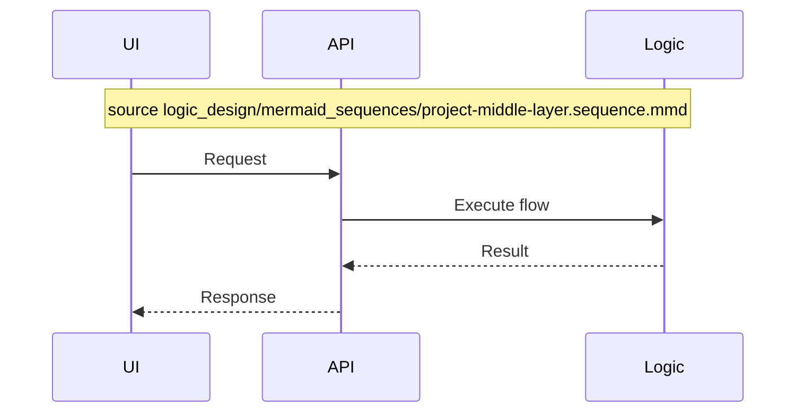
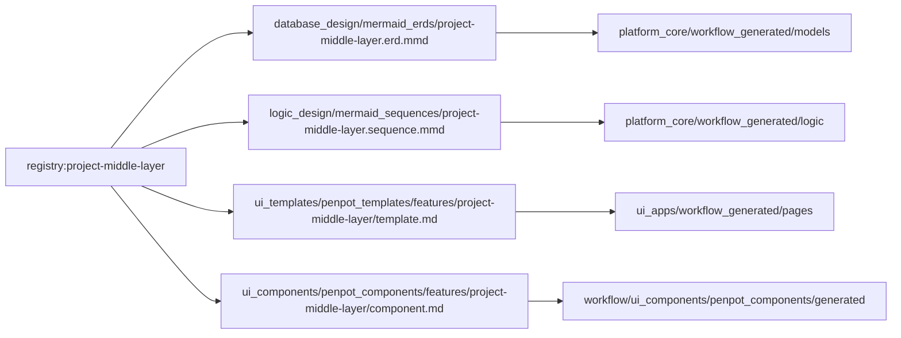
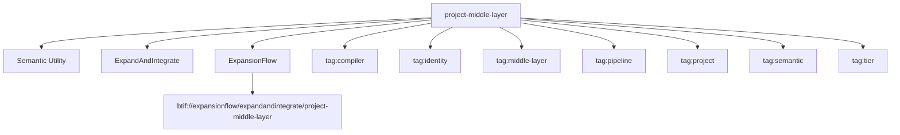

# Workflow Feature Visualization

## ERD Relationships

```mermaid
graph TD
%% feature: Project Middle Layer
%% slug: project-middle-layer
%% mlas_tier: Semantic Utility
%% btif_classification: ExpansionFlow
    FEATURE_project_middle_layer[project-middle-layer] --> ERD[database_design/mermaid_erds/project-middle-layer.erd.mmd]
    ERD --> ENTITY[FEATURE_ENTITY]
    ENTITY --> FIELD_ID[id]
    ENTITY --> FIELD_NAME[name]
```

## Sequence Flow

```mermaid
sequenceDiagram
%% feature: Project Middle Layer
%% slug: project-middle-layer
%% mlas_tier: Semantic Utility
%% btif_classification: ExpansionFlow
    participant UI
    participant API
    participant Logic
    Note over UI,Logic: source logic_design/mermaid_sequences/project-middle-layer.sequence.mmd
    UI->>API: Request
    API->>Logic: Execute flow
    Logic-->>API: Result
    API-->>UI: Response
```

## Dependency Graph

```mermaid
graph LR
%% feature: Project Middle Layer
%% slug: project-middle-layer
%% mlas_tier: Semantic Utility
%% btif_classification: ExpansionFlow
    REG[registry:project-middle-layer] --> ERD[database_design/mermaid_erds/project-middle-layer.erd.mmd]
    REG --> SEQ[logic_design/mermaid_sequences/project-middle-layer.sequence.mmd]
    REG --> UIT[ui_templates/penpot_templates/features/project-middle-layer/template.md]
    REG --> UIC[ui_components/penpot_components/features/project-middle-layer/component.md]
    ERD --> MODELS[platform_core/workflow_generated/models]
    SEQ --> LOGIC[platform_core/workflow_generated/logic]
    UIT --> PAGES[ui_apps/workflow_generated/pages]
    UIC --> DSGEN[workflow/ui_components/penpot_components/generated]
```

## Semantic Classification Map

```mermaid
graph TD
%% feature: Project Middle Layer
%% slug: project-middle-layer
%% mlas_tier: Semantic Utility
%% btif_classification: ExpansionFlow
    FEATURE[project-middle-layer] --> MLAS[Semantic Utility]
    FEATURE --> INTENT[ExpandAndIntegrate]
    FEATURE --> BTIF_CLASS[ExpansionFlow]
    BTIF_CLASS --> BTIF_ROUTE[btif://expansionflow/expandandintegrate/project-middle-layer]
    FEATURE --> TAG_compiler[tag:compiler]
    FEATURE --> TAG_identity[tag:identity]
    FEATURE --> TAG_middle-layer[tag:middle-layer]
    FEATURE --> TAG_pipeline[tag:pipeline]
    FEATURE --> TAG_project[tag:project]
    FEATURE --> TAG_semantic[tag:semantic]
    FEATURE --> TAG_tier[tag:tier]
```
